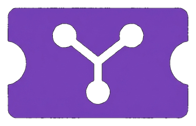

# Yesod (יסוד)

Ultra-light self-hosted issue tracker for a single user.

<p align="center">
  
</p>

AI coding makes it easy to produce work quickly, but it also makes task boundaries and history harder to keep clean. I wanted a small local ticket board that could stay open while I work with Claude Code: record context, turn new follow-ups into todos immediately, and keep lightweight history without pulling in a full project-management system.

Yesod is for that use case. It is meant to be simple to run, light on resources, and focused on local ticket management.

<sub>The name is motivated by my favorite game.</sub>

## Run

```bash
git clone https://github.com/newfull5/Yesod.git
cd Yesod
docker compose up -d
```

Open `http://localhost:8080`.

Data is stored in `./data/yesod.db`.

Or run the published image:

```bash
docker run -d \
  --name yesod \
  -p 8080:8080 \
  -v "$PWD/data:/data" \
  ghcr.io/newfull5/yesod:v0.1.0
```

## Settings

Set a password:

```bash
YESOD_PASSWORD='change-me' docker compose up -d
```

## License

MIT

## Citation

```bibtex
@software{yesod,
  title = {Yesod},
  author = {Saechan Oh},
  year = {2026},
  url = {https://github.com/newfull5/Yesod},
  license = {MIT}
}
```
