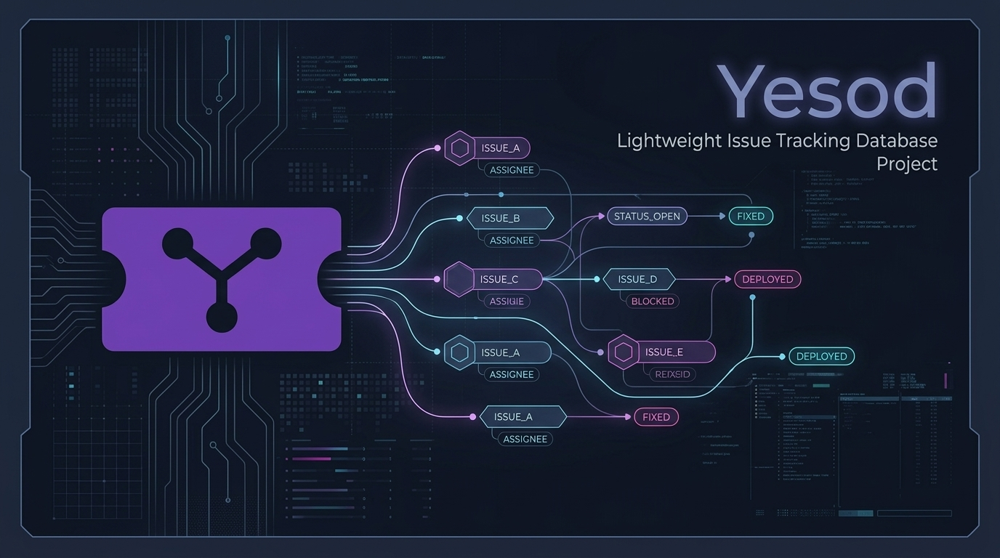

# Yesod (יסود) — Ultra-light Self-hosted Issue Tracker

<p align="center">
  
</p>

**Yesod** ("Foundation" in Hebrew) is an ultra-lightweight, single-user Jira alternative designed to run on resource-constrained home servers (with less than 4GB RAM) with an idle memory footprint of **under 20MB** (Docker container stats: ~15.7MiB).

It compiles into a single, dependency-free binary with a beautiful React-based Kanban board embedded using Go `embed.FS`, uses CGO-free SQLite for zero-config data storage, and provides a built-in Model Context Protocol (MCP) server so that you can interact with your task tracker directly via Claude Code.

---

## Key Features

1. **Drag-and-Drop Kanban Board** — Easily move issues across columns (Todo → In Progress → Done) using a smooth drag-and-drop interface driven by `@dnd-kit/core`.
2. **Backlog View** — Prioritize issues and assign them to active or future sprints via drag-and-drop lists.
3. **Rich Metadata Layout** — A two-column issue detail modal mirroring Jira (description, sub-tasks, linked tasks, assignees, reporters, sprints, start/due dates, teams, comments).
4. **Claude Code / MCP Server** — Direct integration with AI assistants. List, fetch, create, comment on, and assign issues using natural language.
5. **No Overhead (YAGNI)** — No notifications, complex workflow definitions, multi-user permissions, or heavy search index engines. Zero-setup single-user design.

---

## Project Structure

```
Yesod/
├── main.go              # Go HTTP server serving REST API and embedded UI
├── internal/
│   ├── db/              # Database connection, schemas, and query helpers
│   └── api/             # HTTP REST handlers
├── web/                 # Vite + React + TypeScript + dnd-kit Frontend
│   ├── public/          # Static assets (including Yesod brand logo)
│   ├── src/             # App, Board, Backlog, and Detail components
│   └── dist/            # Built assets embedded into Go binary
├── mcp/                 # Node.js MCP server implementation
├── Dockerfile           # Multi-stage build for scratch binary container
└── docker-compose.yml   # Volume-mounted SQLite production compose spec
```

---

## Getting Started

### Prerequisites
- [Go](https://go.dev/) 1.22+
- [Node.js](https://nodejs.org/) v20+

### Development

Start the backend Go API server (listening on `:8080`) and Vite development server (listening on `:5173`, automatically proxying `/api` requests) concurrently:

```bash
make dev
```

Run test suites for the Go backend:

```bash
make test
```

### Production Build & Run

Build the React frontend assets, embed them into Go, and build the static `./yesod` executable:

```bash
make build
```

Run the compiled server (defaults to port `:8080` and `./data/yesod.db` database path):

```bash
YESOD_ADDR=:8080 YESOD_DB=./data/yesod.db ./yesod
```

### Docker Deploy

You can run Yesod instantly via Docker:

```bash
docker compose up -d
```
The application will be accessible at `http://localhost:8080`.

---

## Claude Code (MCP) Integration

To hook Yesod up with Claude Code:

```bash
claude mcp add yesod -- node /absolute/path/to/Yesod/mcp/index.js
```

### Environment Variables for MCP:
- `YESOD_URL`: API URL of your Yesod instance (e.g., `http://localhost:8080`).
- `YESOD_ME`: Your username (e.g., `Saechan`) to resolve "assign to me" actions.
- `YESOD_PASSWORD`: (Optional) Password for instance access if authentication is configured.
