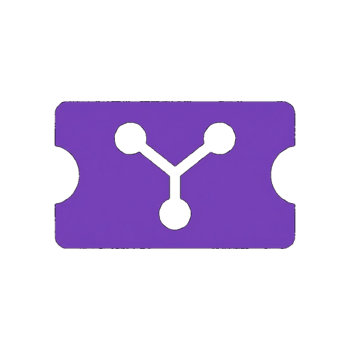

# Yesod (יסוד)

Ultra-light self-hosted issue tracker for a single user.

<p align="center">
  
</p>

**Yesod** ("foundation" in Hebrew) is a lightweight, self-hosted issue tracker for small personal workflows and resource-constrained home servers. It runs as a Go HTTP server with an embedded React Kanban UI, stores data in CGO-free SQLite, and includes a companion Model Context Protocol (MCP) server for AI-assisted issue management.

The project intentionally avoids team-management overhead such as notifications, complex workflow builders, and multi-user permission systems.

## Features

- **Kanban board**: Move issues across Todo, In Progress, and Done columns with drag-and-drop.
- **Backlog view**: Prioritize issues and assign them to active or future sprints.
- **Issue detail modal**: Track descriptions, subtasks, linked issues, assignees, reporters, sprints, dates, teams, and comments.
- **Optional password gate**: Set `YESOD_PASSWORD` to require login for API and UI access.
- **Companion MCP server**: List, fetch, create, update, assign, and comment on issues from MCP-capable assistants.
- **Small deployment shape**: One Go server process, embedded frontend assets, and a local SQLite database.

## Project Structure

```text
Yesod/
├── main.go              # Go HTTP server serving REST API and embedded UI
├── internal/
│   ├── db/              # Database connection, schema, and query helpers
│   └── api/             # HTTP REST handlers
├── web/                 # Vite + React + TypeScript frontend
│   ├── public/          # Static web assets
│   ├── src/             # App, board, backlog, and issue detail components
│   └── dist/            # Built assets embedded into the Go binary
├── mcp/                 # Node.js stdio MCP server
├── assets/              # Project logo assets
├── Dockerfile           # Multi-stage container build
└── docker-compose.yml   # Local compose deployment
```

## Requirements

- Go 1.26+
- Node.js 22+
- npm

## Development

Install frontend dependencies first if this is a fresh checkout:

```bash
cd web
npm install
cd ..
```

Start the Go API server on `:8080` and the Vite dev server on `:5173`:

```bash
make dev
```

Run the Go test suite:

```bash
make test
```

## Production Build

Build the React frontend, embed it into the Go binary, and produce `./yesod`:

```bash
make build
```

Run the compiled server:

```bash
YESOD_ADDR=:8080 YESOD_DB=./data/yesod.db ./yesod
```

The app is available at `http://localhost:8080`.

## Docker

Build and run with Docker Compose:

```bash
docker compose up -d
```

The compose file mounts `./data` into the container so the SQLite database persists across restarts.

To enable the optional password gate:

```bash
YESOD_PASSWORD='change-me' docker compose up -d
```

## Configuration

### Server

| Variable | Default | Description |
| --- | --- | --- |
| `YESOD_ADDR` | `:8080` | HTTP listen address. |
| `YESOD_DB` | `./data/yesod.db` | SQLite database path. |
| `YESOD_PASSWORD` | unset | Enables password login when set. |

### MCP

| Variable | Default | Description |
| --- | --- | --- |
| `YESOD_URL` | `http://localhost:8080` | Base URL for the Yesod API. |
| `YESOD_ME` | `Saechan` | Person name used by "assign to me" and default comments. |
| `YESOD_PASSWORD` | unset | Password used by the MCP server when the Yesod instance requires login. |

## MCP Integration

Install MCP dependencies:

```bash
cd mcp
npm install
```

Add the server to Claude Code:

```bash
claude mcp add yesod -- node /absolute/path/to/Yesod/mcp/index.js
```

For a password-protected instance:

```bash
YESOD_URL=http://localhost:8080 YESOD_PASSWORD='change-me' claude mcp add yesod -- node /absolute/path/to/Yesod/mcp/index.js
```

## Citation

If you reference this project, cite it using the metadata in [CITATION.cff](CITATION.cff).

## License

Yesod is licensed under the MIT License. See [LICENSE](LICENSE).
